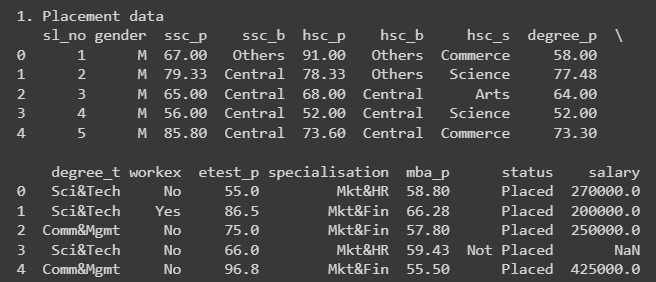
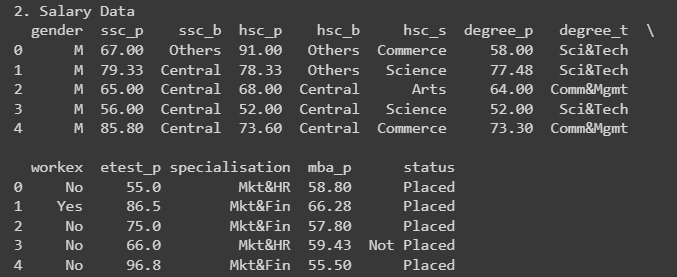
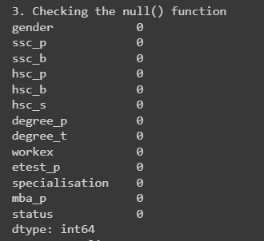
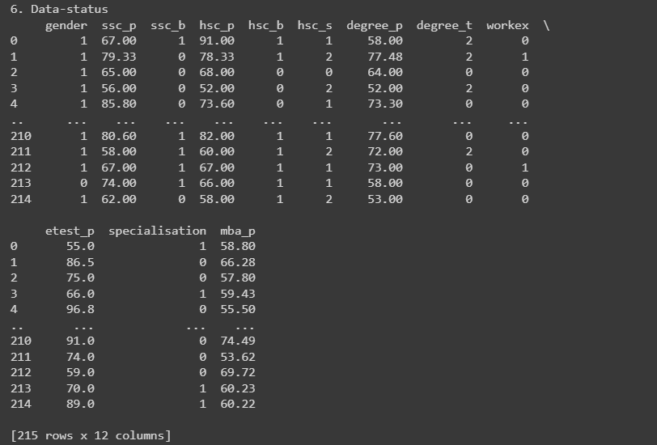
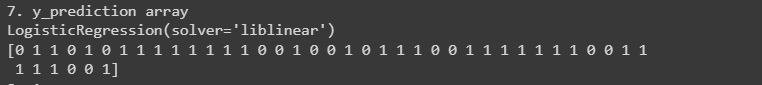
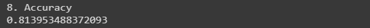
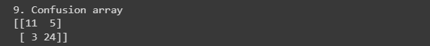
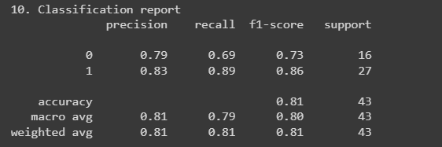
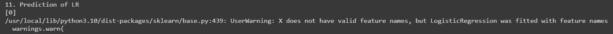

# Implementation-of-Logistic-Regression-Model-to-Predict-the-Placement-Status-of-Student

## AIM:
To write a program to implement the the Logistic Regression Model to Predict the Placement Status of Student.

## Equipments Required:
1. Hardware – PCs
2. Anaconda – Python 3.7 Installation / Jupyter notebook

## Algorithm
1. import pandas module.

2. Read the required csv file using pandas . 

3. Import LabEncoder module.

4. From sklearn import logistic regression.

5. Predict the values of array.

6. Calculate the accuracy, confusion and classification report by importing the required modules from sklearn.

7. print the required values.

8. End the program.
 

## Program:
```
/*
Program to implement the the Logistic Regression Model to Predict the Placement Status of Student.
Developed by: Akshith Jobirin S
RegisterNumber: 212220040007

import pandas as pd

data = pd.read_csv("Placement_Data.csv")

print("1. Placement data")
print(data.head())


data1 = data.copy()
data1= data1.drop(["sl_no","salary"],axis=1)

print("2. Salary Data")
print(data1.head())

print("3. Checking the null() function")
print(data1.isnull().sum())

print("4. Data Duplicate")
print(data1.duplicated().sum())

from sklearn.preprocessing import LabelEncoder
lc = LabelEncoder()

data1["gender"] = lc.fit_transform(data1["gender"])
data1["ssc_b"] = lc.fit_transform(data1["ssc_b"])
data1["hsc_b"] = lc.fit_transform(data1["hsc_b"])
data1["hsc_s"] = lc.fit_transform(data1["hsc_s"])
data1["degree_t"]=lc.fit_transform(data["degree_t"])
data1["workex"] = lc.fit_transform(data1["workex"])
data1["specialisation"] = lc.fit_transform(data1["specialisation"])
data1["status"]=lc.fit_transform(data1["status"])


print("5. Print data")
print(data1)

y = data1["status"]
print("6. Data-status")
x = data1.iloc[:,:-1]
print(x)

from sklearn.model_selection import train_test_split
x_train, x_test, y_train, y_test = train_test_split(x,y,test_size=0.2,random_state=0)

from sklearn.linear_model import LogisticRegression
lr = LogisticRegression(solver="liblinear")

print("7. y_prediction array")
print(lr.fit(x_train,y_train))
y_pred = lr.predict(x_test)
print(y_pred)


from sklearn.metrics import accuracy_score
accuracy = accuracy_score(y_test,y_pred)
print("8. Accuracy")
print(accuracy)


from sklearn.metrics import confusion_matrix
confusion = confusion_matrix(y_test,y_pred)
print("9. Confusion array")
print(confusion)


from sklearn.metrics import classification_report
classification_report1 = classification_report(y_test,y_pred)

print("10. Classification report")
print(classification_report1)

prediction = [1,67,1,91,1,1,58,2,0,55,1,58.80]
print(lr.predict([prediction])) 


prediction = [1,80,1,90,1,1,90,1,0,85,1,85]
print("11. Prediction of LR")
print(lr.predict([prediction]))
*/
```

## Outputs:
### Output-1:

### Output-2:

### Output-3:

### Output-4:

### Output-5:

### Output-6:

### Output-7:

### Output-8:

### Output-9:

### Output-10:

### Output-11:



## Result:
Thus the program to implement the the Logistic Regression Model to Predict the Placement Status of Student is written and verified using python programming.
